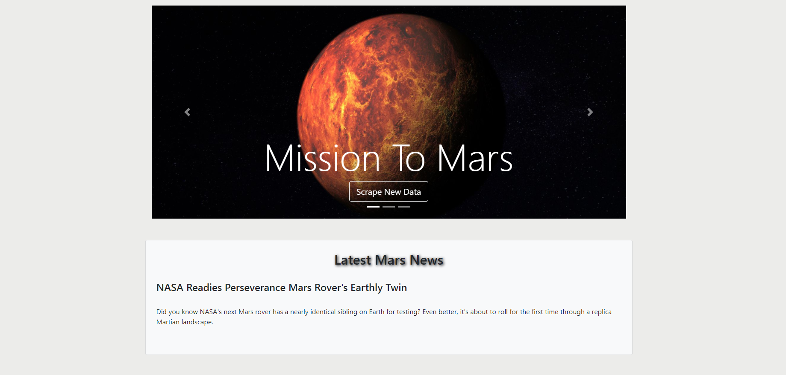
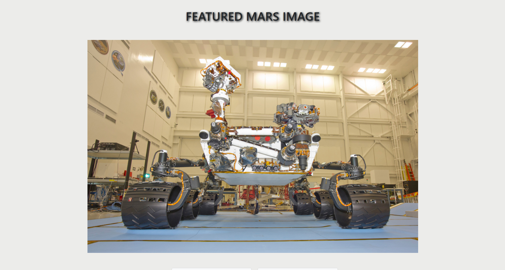
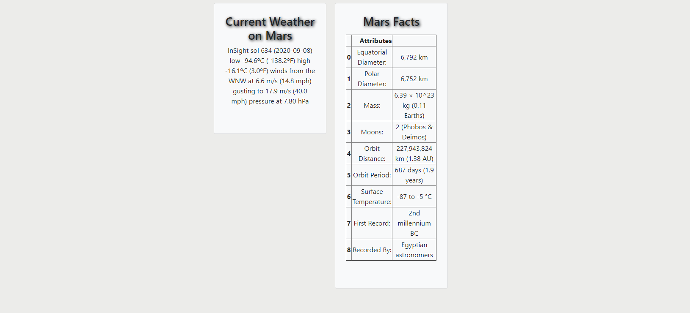
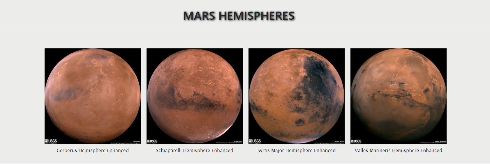

# Mission To Mars
 
<ul>
  <li> For initial scraping of websites, I used Jupyter Notebook, BeautifulSoup, Pandas, and Requests/Splinter, and then assigned the text to variables </li>
  <li> Websites scraped:</li>  
    <a href="https://mars.nasa.gov/news/" target="blank"> Nasa Mars News Site</a>  
    <a href="https://www.jpl.nasa.gov/spaceimages/?search=&category=Mars" target="blank">JPL Featured Space Image </a> 
    <a href="https://twitter.com/marswxreport?lang=en" target="blank">Twitter- Mars Weather @MarsWxReport</a>  
    <a href="https://astrogeology.usgs.gov/search/results?q=hemisphere+enhanced&k1=target&v1=Mars" target="blank">USGS Astrogeology</a> 
    <a href="https://space-facts.com/mars/" target="blank"> Mars Fact Webpage </a>  
  <li>Used MongoDB with Flask to create an HTML page that displays all of the information that was scraped from the URLs above, used Bootstrap to structure the HTML template.

<h2><b>To open web application:</b></h2>
<ol>
  <li>Clone this repository to your computer</li>
  <li>In your console, change directories to the location of the repository in your computer and run the flask app by entering 'python app.py' </li>
</ol>  

 
 
 
 
